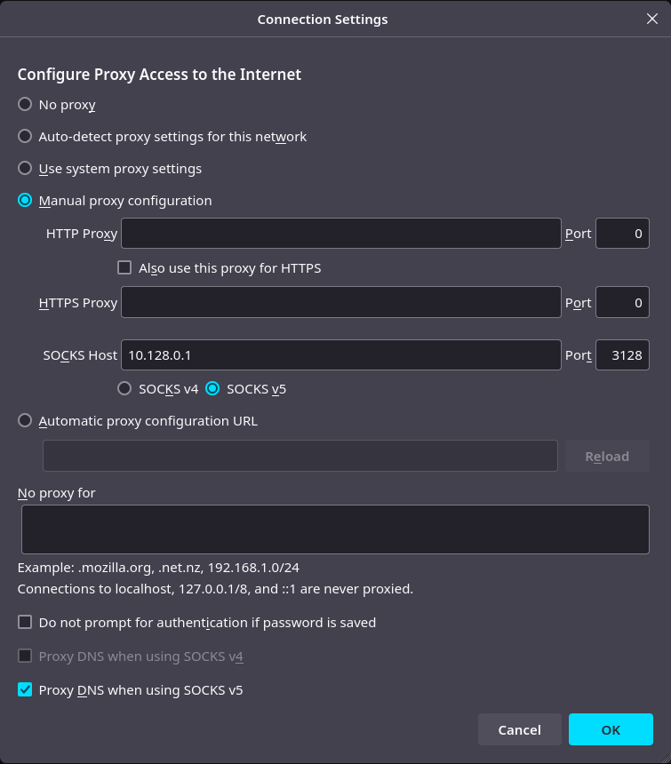

# Onboarding

The GnosisVPN proof of concept is a work in progress and may be updated at any time.
It may therefore be unstable or contain bugs, and should not be used in situations which require full anonymity.
Use at your own risk.
For testing and debugging, exit nodes currently gather logs. These logs cannot reveal user requests, server responses, IPs, or any other identifying information.
Logs are deleted after thirty days.

The software is licensed under the GNU Lesser General Public License v3.0 and may be freely used, modified, and distributed in accordance with the license terms.
Users should check local laws before using the PoC (including operating a relay node).
Users are solely responsible for how they use and interact with the PoC, and for complying with applicable laws.
The PoC should not be used for illegal, malicious, or unethical purposes.

The following 6-step process will guide you through these topics:

- **Configure your hoprd node** to allow a GnosisVPN connection.
- **Install the GnosisVPN client and WireGuard tools**.
- **Configure Firefox proxy settings** to use the GnosisVPN connection.
- **Leave feedback** by filling out the [feedback form](https://cryptpad.fr/form/#/2/form/view/ID9xmo4wYOdM4ZOzCiVMf5w6ZJehzNaIC53gkNS6C+k/).

#### TODO: Having trouble with the PoC? Check out the [FAQ](FAQ.md).

For any questions or assistance, feel free to join the [GnosisVPN Discord support channel](https://discord.com/channels/502416149343109121/1337126805995262093).

---

## 1. Configure your hoprd node to allow GnosisVPN connections

GnosisVPN will create a UDP connection to your hoprd node on a specified port (e.g., `1422`).

Treat this as an additional port for hoprd that needs the same treatment as the peer-to-peer port and API port.
If you set up any firewall rules or [port forwarding](https://docs.hoprnet.org/node/port-forwarding) for those ports, you will need to do the same for the GnosisVPN port.

Additionally, you need to configure your hoprd node to allow GnosisVPN connections.
The usual way of running hoprd is in a Docker container. This means you need to configure Docker to forward that port.

Depending on your setup, this can be done in different ways.

### Hoprd for Docker

Update the `hoprd` run command to include the port forwarding:

```bash
docker run ... -p 1422:1422/udp ...
```

### Hoprd for Docker Compose

Locate `docker-compose.yaml` and update the `ports:` section of `hoprd`:

```yaml
services:
  hoprd:
    ...
    ports:
      ...
      - "1422:1422/udp"
```

### Hoprd for Dappnode

1. Connect to your Dappnode.
2. Navigate to the **HOPR package**.
3. Go to the **Network** tab and locate the **Public Port Mapping** section.
4. Add a new port entry by clicking on **New port +**.
5. Configure the following settings:

- **HOST PORT**: `1422`
- **PACKAGE PORT NUMBER**: `1422`
- **PROTOCOL**: Select **UDP**.

6. Click **Update Port Mappings** to save your changes.
7. Ensure you configure port forwarding on your router to expose the REST API port `3001` and the UDP port `1422` to the internet.

## 2. Enable GnosisVPN to establish connections to the Exit Nodes from your hoprd node

**Caution:** If you have **channel auto-funding** enabled on your hoprd node, you might drain your funds quickly.
To verify this, connect to your node via the **Admin UI** of your hoprd node and navigate to the **Configuration** page.
Look at the **Strategies** section and ensure that `!AutoFunding` is **absent**.

**Important Note:** Currently, GnosisVPN can only establish connections through high-profile relay nodes maintained by the community.
To use GnosisVPN, you must have an open payment channel from your entry node to the relayer node associated with your chosen exit node.
The relay node address can be found on the [GnosisVPN servers](https://gnosisvpn.com/servers) page.

### Steps to Open a Payment Channel

1. Connect to your node via the **Admin UI** of your hoprd node.
2. Navigate to the **PEERS** page.
3. Search for the peer you’ve chosen as a relayer node from [GnosisVPN servers](https://gnosisvpn.com/servers).
4. Click on **OPEN outgoing channel**.
5. Enter the funding amount (recommended: **15 wxHOPR**) and click **Open Channel**.
6. Once the channel is successfully opened, it will appear under the **CHANNELS: OUT** page.

## 3. Install WireGuard tools

### macOS

Using [Homebrew](https://brew.sh/), install [WireGuard tools](https://formulae.brew.sh/formula/wireguard-tools#default) by running:

`brew install wireguard-tools`

### Linux

Install WireGuard tools using your package manager. See [WireGuard installation guide](https://www.wireguard.com/install/) for more details.

## 4. Install GnosisVPN client

Use the [installer](./installer.sh) script to download GnosisVPN and generate an initial config.
Or use this oneliner: `bash -c "$(curl -fsSL https://raw.githubusercontent.com/gnosis/gnosis_vpn-client/HEAD/install.sh)"`.

Follow the instructions to complete the installation.

## 5. Launch the GnosisVPN client system service and connect to a destination

1. Open a terminal and run the command outlined by the installer to launch the GnosisVPN client.
   This command usually looks like this: `sudo <some_path>/gnosis_vpn -c <some_path>/config.toml`.

2. In a separate terminal, run the control application to list available destinations.
    Similarily, the command will be outlined by the installer and usually looks like this: `<some_path>/gnosis_vpn-ctl status`.

3. Choose a destination from the list and connect to it.
    Again the installer will provide the command to do this: `<some_path>/gnosis_vpn-ctl connect <destination peer id>`.

## 6. Use GnosisVPN connection to browse the internet

For now, we provide a specific HTTPS proxy connection that you need to configure in your browser.
The easiest way to do this is to change the Firefox proxy settings.

1. Open **Network Connection Settings** by navigating to **Settings → General → Network Settings** or search "proxy" in the settings search bar and click on the **Settings** button.
2. Choose **manual proxy configuration** and enter:

- **HTTP Proxy**: `10.128.0.1`
- **Port**: `3128`
- Check **Also use this proxy for HTTPS**

4. Click **OK** to save the settings.
   Start browsing through GnosisVPN.

---

## 5. Configure your hoprd node to allow GnosisVPN connections [Linux]

GnosisVPN will create a UDP connection to your hoprd node on a specified port (e.g., `1422`).

Treat this as an additional port for hoprd that needs the same treatment as the peer-to-peer port and API port.
If you set up any firewall rules or [port forwarding](https://docs.hoprnet.org/node/port-forwarding) for those ports, you will need to do the same for the GnosisVPN port.

Additionally, you need to configure your hoprd node to allow GnosisVPN connections.
The usual way of running hoprd is in a Docker container. This means you need to configure Docker to forward that port.

Depending on your setup, this can be done in different ways.

#### Hoprd for Docker [Linux]

Update the run command to include the port forwarding:

```bash
docker run ... -p 1422:1422/udp ...
```

#### Hoprd for Docker Compose [Linux]

Locate `docker-compose.yaml` and update the `ports:` section of `hoprd`:

```yaml
services:
  hoprd:
    ...
    ports:
      ...
      - "1422:1422/udp"
```

#### Hoprd for Dappnode [Linux]

1. Connect to your Dappnode.
2. Navigate to the **HOPR package**.
3. Go to the **Network** tab and locate the **Public Port Mapping** section.
4. Add a new port entry by clicking on **New port +**.
5. Configure the following settings:

- **HOST PORT**: `1422`
- **PACKAGE PORT NUMBER**: `1422`
- **PROTOCOL**: Select **UDP**.

6. Click **Update Port Mappings** to save your changes.

### 6. Configure GnosisVPN client - hoprd node [Linux]

1. Create a folder in your home directory called `gnosisvpn-poc`.
2. Download the [config.toml file](./config.toml) and move it into that folder.
3. Edit the `config.toml` and locate the `[hoprd_node]` section to adjust these values:

```toml
[hoprd_node]
endpoint = "http://<hoprd node ip>:<hoprd node API port>"
api_token = "<hoprd node API token>"

internal_connection_port = 1422
```

- `endpoint` is the URL (including port) pointing to the API access of your node (e.g., `http://192.168.0.89:3001`).
- `api_token` is the API access token of your node.
- `internal_connection_port` is the static UDP port which you configured in step 5.

If you prefer a more extensively documented configuration file, try using [documented config](./documented-config.toml).

### 7. Configure GnosisVPN client - exit location [Linux]

Visit [GnosisVPN servers](https://gnosisvpn.com/servers) and choose an exit location.
Copy the settings into your `config.toml`:

```toml
[connection]
destination = "<exit node peer id>"

[connection.path]
intermediates = ["<community relayer peer id>"]
```

- `destination` is the peer ID of the chosen exit node.
- `intermediates` specifies the community relay node used to establish the connection.

Save and close the configuration file.

### 8. Enable GnosisVPN to establish connections to the Exit Nodes from your hoprd node [Linux]

**Caution:** If you have **channel auto-funding** enabled on your hoprd node, you might drain your funds quickly.
To verify this, connect to your node via the **Admin UI** of your hoprd node and navigate to the **Configuration** page.
Look at the **Strategies** section and ensure that `!AutoFunding` is **absent**.

**Important Note:** Currently, GnosisVPN can only establish connections through high-profile relay nodes maintained by the community.
To use GnosisVPN, you must have an open payment channel from your entry node to the relayer node associated with your chosen exit node.
The relay node address can be found on the [GnosisVPN servers](https://gnosisvpn.com/servers) page.

#### Steps to Open a Payment Channel [Linux]

1. Connect to your node via the **Admin UI** of your hoprd node.
2. Navigate to the **PEERS** page.
3. Search for the peer you’ve chosen as a relayer node from [GnosisVPN servers](https://gnosisvpn.com/servers).
4. Click on **OPEN outgoing channel**.
5. Enter the funding amount (recommended: **15 wxHOPR**) and click **Open Channel**.
6. Once the channel is successfully opened, it will appear under the **CHANNELS: OUT** page.

### 9. Download the latest binary file [Linux]

Download the latest GnosisVPN binary file for your system by visiting the [GitHub releases](/../../releases/latest) page.
Choose the binary file that matches your system:

| system                    | binary file                |
| ------------------------- | -------------------------- |
| linux with x86 chip       | `gnosis_vpn-x86_64-linux`  |
| linux with newer ARM chip | `gnosis_vpn-aarch64-linux` |
| linux with older ARM chip | `gnosis_vpn-armv7l-linux`  |

Ignore the `*-ctl-*` sibling files.
We do not need them for now.

Move the downloaded binary into your `gnosisvpn-poc` folder next to your `config.toml`.
In the following steps, we assume you downloaded `gnosis_vpn-x86_64-linux` to keep the instructions consistent.

### 10. Ready to start the GnosisVPN binary file [Linux]

1. Make the downloaded binary executable by running the following command in your terminal:

```bash
chmod +x ~/gnosisvpn-poc/gnosis_vpn-x86_64-linux
```

2. Provide the path to your configuration file and launch the GnosisVPN binary file:

```bash
sudo GNOSISVPN_CONFIG_PATH=~/gnosisvpn-poc/config.toml ~/gnosisvpn-poc/gnosis_vpn-x86_64-linux
```

If you see immediate errors on startup, it is most likely due to errors in your configuration settings.
The logs will indicate which setting parameter might be wrong.

### 11. Create a WireGuard interface to use the established GnosisVPN connection [Linux]

Create a file called `gnosisvpnpoc.conf` inside `/etc/wireguard/` with the following content.
Replace placeholders `<...>` with the actual values as documented.

```conf
[Interface]
PrivateKey = <Generated during step 1>
ListenPort = 51820
Address = <WireGuard IP> # received via **rentry.co** document, e.g., 10.128.0.5/32

[Peer]
PublicKey = <lm0QdCOxg4BxQK1wHujjHsOtSUKrNFgfbGxyWUH+hRk=> # listed on https://gnosisvpn.com/servers
Endpoint = <your hoprd node IP:1422> # port needs to match your `internal_connection_port` configuration
AllowedIPs = 10.128.0.0/9
PersistentKeepalive = 30
```

Activate the WireGuard device with:

```bash
sudo wg-quick up gnosisvpnpoc
```

### 12. Use GnosisVPN connection to browse the internet [Linux]

For now, we only allow SOCKS v5 proxy connections tunneled through GnosisVPN.
The easiest way to do this is to change the Firefox proxy settings.

1. Open **Network Connection Settings** by navigating to **Settings → General → Network Settings** or search "proxy" in the settings search bar and click on the **Settings** button.
2. Choose **manual proxy configuration** and enter:

- **SOCKS Host**: `10.128.0.1`
- **Port**: `3128`
- **Socks v5**

3. Make sure the `Proxy DNS when using SOCKS v5` option is enabled.



4. Click **OK** to save the settings.

Start browsing [these select sites](https://gnosisvpn.com/servers#allowlist) through GnosisVPN.
